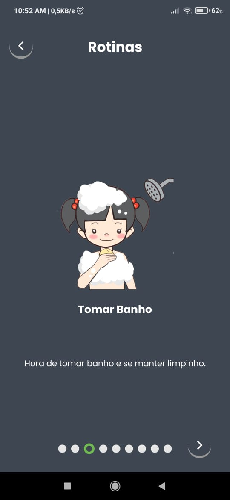

:construction: Projeto em desenvolvimento  :construction:
<h2 align="center">
  Projeto Crianca
  

  Ajudando pais e filhos com a comunicação e aprendizado
</h2>

  
  
  
  

## 🧾 》Introducao
Esse projeto tem como intenção auxiliar as famílias de crianças/adolescentes autistas a melhorar a comunicação (não verbal) através de atividades pedagógicas adaptadas para as crianças.
O projeto foi pensado para rodar nas mais diversas plataformas e sistemas operacionais, mas atualmente a equipe está com um foco no Android.

## 🧰 》Tecnologias usadas
Para desenvolver o projeto, nossa equipe decidiu usar um kit básico de ferramentas para o desenvolvimento mobile, pensando em atender os dois sistemas mais utilizados no mundo hoje (Android e IOS). 
- React Native 
- Node.js  
- Expo 
- Firebase
- Git

## 🤝🏼 》Parcerias
Abaixo temos uma lista dos atuais parceiros do projeto. 
- Unisociesc 

## 📷 》Imagens do projeto
### Login e Cadastro

  
  
  
  

### Avatar

  
  
  

### Menus

  
  
  
  
  

### Jogo da Memoria

  
  
  

### Exprecoes

  
  
  
  
  
  
  
  
  

### Rotina

  
  
  
  
  
  
  
  
  

### Avatar Dark

  
  
  

### Menus Dark

  
  
  
  

### Jogo da Memoria Dark

  
  
  

### Exprecoes Dark

  
  
  
  
  
  
  
  
  

### Rotina

  
  
  
  
  
  
  
  
  

# 📈 》Continuous Deployment com Netlify

https://projetocrianca.netlify.app/

